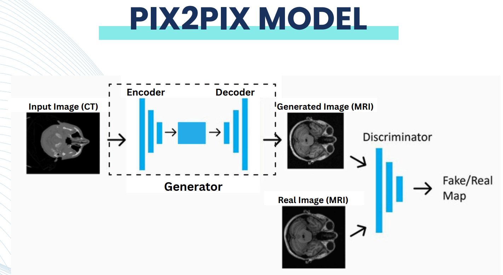
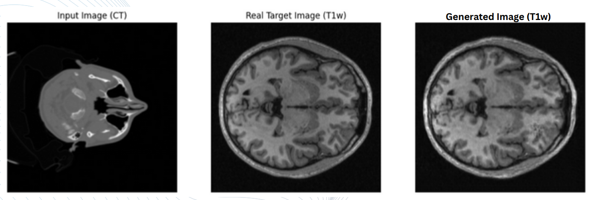
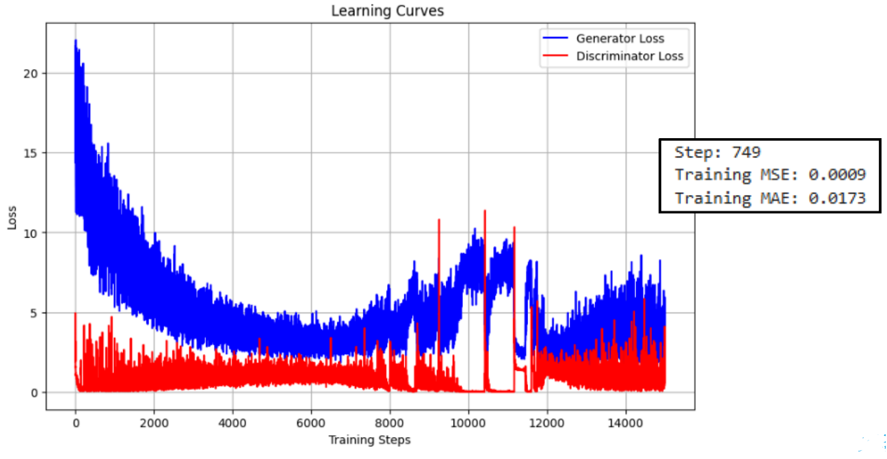

# CT to MRI Image Synthesis using Pix2Pix 🧠🖼️

This project synthesizes high-fidelity MRI images from CT scans using a Conditional GAN (Pix2Pix) architecture, trained on paired medical image datasets. Deployed on embedded DSP for real-time inference.

## 🔬 Project Summary

- **Model:** Pix2Pix Conditional GAN with U-Net Generator (48M+ parameters)
- **Dataset:** 37 paired CT/MRI image slices (medical-grade, pre-registered)
- **Goal:** Generate MRI-quality imaging from lower-cost CT scans
- **Deployment:** Texas Instruments TMS320 DSP, C-ported, real-time performance

---

## 📊 Key Results

| Metric       | Value     |
|--------------|-----------|
| SSIM         | `0.9598`  |
| PSNR         | `36.23 dB`|
| Inference    | `200 ms`  |
| Throughput   | `5 FPS`   |
| Power Usage  | `< 5W`    |

---

## 🧠 Architecture

---

## 🚀 Workflow

1. **Data Preprocessing** (Slicing, Normalization)
2. **Model Training** (Pix2Pix with U-Net Generator + PatchGAN Discriminator)
3. **Performance Evaluation** (SSIM, PSNR)
4. **Deployment Pipeline**
   - Model export & quantization
   - Ported to TMS320 DSP in embedded C
   - Real-time inference loop on medical device

---

## 🔧 Technologies Used

| Category         | Tools & Libraries                      |
|------------------|----------------------------------------|
| Deep Learning    | PyTorch, Pix2Pix, U-Net                |
| Data Handling    | NumPy, PIL, Google Drive               |
| Evaluation       | SSIM, PSNR, Matplotlib                 |
| Deployment       | TMS320 DSP, Embedded C                 |
| Misc             | Google Colab, Streamlit (demo UI)     |

---

## 📷 Sample Outputs

| Synthesized MRI |
|-----------------|
|  |

---

## 📈 Training Curve

---

## 🔐 Note on Code

Due to privacy and IP concerns, the full source code is not made public. For collaboration or demo access, please contact the author via [LinkedIn](https://www.linkedin.com/in/muhammad-tahir-ali-b6256920a/).

---

## 🧑‍💻 Author

**Muhammad Tahir Ali**  
Electrical Engineer | ML & Computer Vision  
📍 Islamabad, Pakistan  
📧 tahir824raja@gmail.com  
🔗 [LinkedIn](https://www.linkedin.com/in/muhammad-tahir-ali-b6256920a/)  
